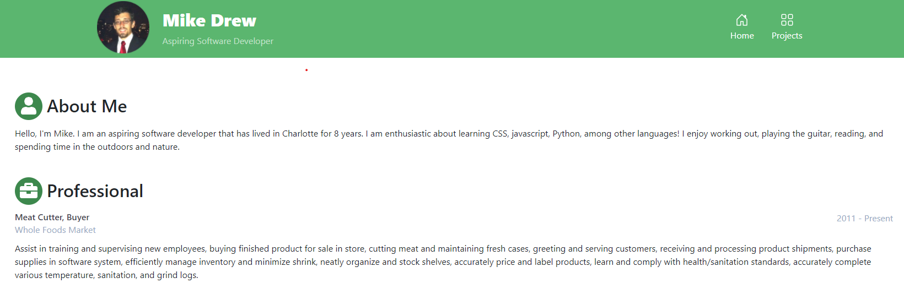

# Portfolio-React

# Week 20 - Updated Portfolio
This repository is an updated version of my portfolio that I started on Week 2.

## Description
* This new portfolio still uses Bootstrap but has been redone as a React app.  
* Fontawesome CSS for icon support.
* 3 newer projects added to portfolio.
* Updated layout to include header, footer, and multiple pages.  

## Screenshot

## Links
* Repository: https://github.com/drewml08/Portfolio-React
* Website: https://drewml08.github.io/Portfolio-React/
